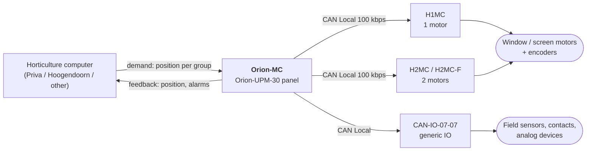

# 02 — System Context & Interfaces

## 2.1 Topology

> ## ⚠️ SCOPE DECISION (2026-10-01)
>
> The product owner has decided that the **new platform does not need BACnet or CAN
> Backbone (CANopen upstream)**. Only two upstream demand interfaces are required:
> **digital open/close** and **0–10 V analog**. This removes priorities 1, 2 and 3 of the
> legacy priority chain below (§2.2) from scope.
>
> **CAN Local to H1MC/H2MC is explicitly retained** — confirmed with the product owner —
> because it is the downstream link to the motor-controller field modules, not the
> upstream link to the horticulture computer. Do not remove it when acting on this
> decision.
>
> The topology diagram and interface table in this file are kept as-is below for
> **historical/legacy reference** so the "what used to exist" picture is not lost, but the
> reduced-scope topology is now in `06-migration-scope.md` §6.1a and should be used for all
> forward design work.



Confirmed by `ORION-MC_DIAGRAM_ENG_Multi Connect_coupled screens`, which shows the climate
computer feeding the Orion-MC over **24 Vac/dc, open/close, 0–5 V / 0–20 mA and an alarm
contact**, with four H2MC / H2MC-F units daisy-chained on CAN-Local. `Documented`

## 2.2 Upstream interfaces — how a demand arrives (legacy — full priority chain)

This is the most important interface to get right on the new platform, so it is given in
full. `MotorgroupGetTargetPosition()` (`inputs/orion-mc/sources/app/c__motorgroep.c:301`) implements a
strict **priority chain**, evaluated only when the group is in AUTO:

| Priority | Condition | Source of demand | Scaling | In reduced scope? |
|---|---|---|---|---|
| 1 | `opt_alg.can_backbone` | CANopen DS-401 analog output | `Calc_Perc(bin, 0x7FFF, 1000)` | **No — removed** |
| 2 | `opt_alg.BACnet_enabled` | BACnet `POSITION_CONTROLLER_DESIRED_POSITION` | direct | **No — removed** |
| 3 | `opt_alg.hoogendoorn_enabled` | Hoogendoorn protocol `pGroup->Setpoint` | direct, ignored if `UNDEFINED` | **No — removed** |
| 4 | `opt_app.Motorgroup[n].AnalogInput` | Analog input channel | ×10 for `TYPE_VENT` / `TYPE_KLEP` | **Yes — kept (0–10 V)** |
| 5 | *(fallback)* | Digital open/close, integrated by the virtual motor | `Calc_Perc_Abs(PositionTime, Runtime, 1000)` | **Yes — kept (open/close)** |

`Implemented`

Three things follow from this that matter for the port:

1. **The internal position unit is tenths of a percent** (0…1000), not percent, and not
   encoder counts. Every interface converts into this unit at the boundary. Preserve it, or
   convert consistently — a silent change to 0…100 would lose resolution the 0–10 V path
   actually uses.
2. **The chain is mutually exclusive and ordered.** CANopen wins over BACnet, which wins
   over Hoogendoorn, which wins over analog. A new platform must not "merge" sources.
3. **Priority 3 confirms a previously open question.** The `hoogendoorn_enabled` flag in the
   code is exactly the Hoogendoorn horticulture-computer integration named in the meeting
   note. The code and the business context line up. `Confirmed`

### Operating-mode override

The demand chain runs **only in AUTO**. The other two modes short-circuit it:

```c
case omManual: pGroup->Delay = 0; break;                    // operator drives directly
case omOff:    PositionPerc = 0; pGroup->Delay = 0; break;  // forced closed
```

`Implemented`

This confirms the manual's statement that **OFF drives the group to 0 %** — OFF is not
"ignore", it is an active command to the closed position. That is a safety-relevant
behaviour and must be carried over deliberately, not reimplemented as a no-op.

> Mapping confirmed against the manual: AUTO / HAND / OFF ↔ `omAuto` / `omManual` / `omOff`,
> and OPEN / CLOSE / STOP ↔ `rmOpen` / `rmClose` / `rmStop`. `Confirmed`

## 2.3 Downstream interface — CAN Local to motor controllers

H1MC (single motor) and H2MC (two motors) are addressed with **CANopen PDO and SDO**, not a
proprietary protocol. The per-component interface is uniform
(`inputs/orion-mc/sources/io/ch_IO_H2MC_mc.h`):

```c
unsigned char IO_H2MC_Motor_Control_PDO_Transmit(unsigned char *ptr, unsigned char card_nr, unsigned char component_nr);
void          IO_H2MC_Motor_Control_PDO_Receive (unsigned char *ptr, unsigned char length, unsigned char card_nr, unsigned char component_nr);
unsigned int  IO_H2MC_Motor_Control_SDO_Master_Transmit(u_SDO_data *ptr, unsigned char card_nr, unsigned char component_nr);
void          IO_H2MC_Motor_Control_SDO_Master_Receive (u_SDO_data *ptr, unsigned char card_nr, unsigned char component_nr);
void          IO_H2MC_Motor_Control_Init  (unsigned char card_nr);
void          IO_H2MC_Motor_Control_100ms (unsigned char card_nr);
```

`Implemented`

The `(card_nr, component_nr)` pair is the addressing scheme: card = physical module on the
bus, component = motor channel within it. H1MC has one component, H2MC has two. The split
into `_board` / `_mc` files separates module housekeeping from motor control.

Per the meeting note, these modules **read the encoders and return position, status and
alarms** — the Orion-MC does not count pulses itself for encoder-equipped motors.
`Documented`

> **Porting constraint.** As long as existing H1MC/H2MC hardware stays in the field, this
> interface is **frozen**: object dictionary, PDO mapping, bit rate and the 100 ms service
> cadence must all be reproduced. This is the least negotiable part of the whole migration.
> It should be captured as an interface specification *before* any new code is written, and
> ideally verified against a real bus capture.

## 2.4 Operator interface

Local LCD panel with soft keys and a menu tree: main group screen → View options /
Change options → option groups (General, Motor groups, Group settings, Alarms, …).
Access is protected by a code set in the General group; **View options is always available**
even without the code. `Documented`

General options include language, screen brightness, LCD dimming (auto-dim after 1 minute of
inactivity), computer number, COM1/USB and COM2 enable with baud rate and modem `ATS0=`
answer count, and network settings (port, IP, mask, gateway). `Documented`

## 2.5 Interface summary table (legacy — full product)

| ID | Interface | Direction | Medium | Frozen by installed base? | In reduced scope? |
|---|---|---|---|---|---|
| IF-01 | Position demand, CANopen | in | CAN Backbone 125 kbps | Yes | **No — removed (2026-10-01)** |
| IF-02 | Position demand, BACnet | in | Ethernet 10 Mbps | Yes | **No — removed (2026-10-01)** |
| IF-03 | Position demand, Hoogendoorn | in | serial | Yes | **No — removed (2026-10-01)** |
| IF-04 | Position demand, analog | in | 0–10 V / 0–20 mA / 5 kΩ pot | Yes | **Yes — 0–10 V only** |
| IF-05 | Position demand, digital | in | open/close contacts | Yes | **Yes** |
| IF-06 | Position feedback | out | mirror of IF-01…IF-04 | Yes | **Yes — mirrors IF-04/IF-05 only** |
| IF-07 | Alarm contact | out | relay, **de-energised on hard alarm** | Yes | Yes |
| IF-08 | Motor control | out | CAN Local 100 kbps, CANopen PDO/SDO | **Yes — hard freeze** | **Yes — explicitly retained** |
| IF-09 | Operator panel | bi | LCD + keys | No — may be redesigned | Yes |
| IF-10 | Service / config | bi | RS232, USB, Ethernet | Negotiable | TBD |

See `06-migration-scope.md` §6.1a for the reduced-scope interface list used for forward
design.
