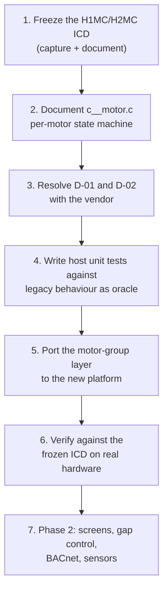

# 06 — Migration Scope

Source: `inputs/orion-mc-docs/260929.info window control from twan.docx`, meeting of
29 September 2026 (Twan, Alexandra, Joris, Kuno), cross-checked against the code.

---

## 6.1 Phase 1 — window control only

| In scope | Where it lives in the legacy code |
|---|---|
| Motor group control | `app/c__motorgroep.c` — `ControlMotorgroup()`, `ControlWindow()` |
| Per-motor control | `app/c__motor.c` |
| Open/close (digital) control | `GetRunningModeMotorgroup()`, `ControlVirtualMotor()` |
| Virtual-motor position simulation | `ControlVirtualMotor()` |
| Communication with H1MC/H2MC over CAN Local | `io/c__IO_H1MC*.c`, `io/c__IO_H2MC*.c` |
| Position feedback to the horticulture computer | `MotorgroupSetFeedback()` |
| Alarm detection and reporting for motors/groups | `ControlAlarmMotorgroup()` |
| AUTO / HAND / OFF operating modes | `omAuto` / `omManual` / `omOff` |
| Calibration and runtime configuration | `GetRuntimeMotorgroup()`, option menus |

Target horticulture computers: ~~**Priva** and **Hoogendoorn**.~~ `Documented` — **see
§6.1a: the Hoogendoorn-protocol upstream interface itself has since been removed from
scope. "Priva and Hoogendoorn" named the business relationships driving the project, not
necessarily a requirement to keep the Hoogendoorn wire protocol.** Confirm with the product
owner whether any Hoogendoorn-branded installation still needs an upstream interface at
all, or whether it will only ever be integrated via the retained analog/digital interfaces.

## 6.1a ⚠️ Upstream interface scope reduced (decision 2026-10-01)

The product owner has decided that the new platform's upstream interface — the link to the
horticulture computer — only needs to support:

- **Digital open/close control** (IF-05)
- **0–10 V analog control** (IF-04, 0–10 V only; 0–20 mA and potentiometer not required
  unless separately confirmed)

**Removed from scope:**

| Interface | Was | Reason removed |
|---|---|---|
| CAN Backbone / CANopen DS-401 (IF-01) | Priority-1 upstream demand source | No longer needed |
| BACnet (IF-02) | Priority-2 upstream demand source | No longer needed |
| Hoogendoorn protocol (IF-03) | Priority-3 upstream demand source | No longer needed |

**Explicitly retained (confirmed with product owner):**

- **CAN Local to H1MC/H2MC (IF-08)** — this is the *downstream* link to the motor
  field modules, not an upstream horticulture-computer interface, and stays in scope
  unchanged. Do not confuse this with the removed CAN *Backbone* interface.

### Effect on `MotorgroupGetTargetPosition()`

Of the five priorities documented in `02-system-context.md` §2.2, only two remain:

```c
// Reduced-scope demand chain — priorities 1-3 removed
case omAuto:
    if (opt_app.Motorgroup[n].AnalogInput)        // kept — 0-10 V
        PositionPerc = IO_Get_Ana_In_One(...);
    else                                            // kept — digital open/close fallback
        PositionPerc = Calc_Perc_Abs(PositionTime, Runtime, 1000);
    break;
```

This is a significant **simplification**, not just a removal: the priority-chain structure,
the `opt_alg.can_backbone` / `BACnet_enabled` / `hoogendoorn_enabled` feature flags, and the
whole BACnet/CANopen-backbone stacks in `inputs/orion-mc/sources/` become dead code for this platform. A
clean-sheet implementation does not need to reproduce the chain at all — it only needs an
`AnalogInput` configured/not-configured branch.

### Effect on feedback (IF-06)

Feedback only ever needs to mirror back over the same two interfaces: an analog output
(0–10 V) or — since digital control has no feedback channel of its own on the legacy
product — the same mechanism used for analog, so the horticulture computer can still read
position. Confirm this with the product owner: **a pure digital (open/close) upstream
interface implies the horticulture computer has no position feedback channel in the legacy
design either**, unless an analog output is wired in parallel. This should be stated
explicitly as a requirement rather than assumed.

### Revised reduced-scope interface list

| ID | Interface | Direction | Medium | Status |
|---|---|---|---|---|
| IF-04 | Position demand, analog | in | 0–10 V | **In scope** |
| IF-05 | Position demand, digital | in | open/close contacts | **In scope** |
| IF-06 | Position feedback | out | analog 0–10 V (digital has none) | **In scope — confirm with product owner** |
| IF-07 | Alarm contact | out | relay, de-energised on hard alarm | In scope |
| IF-08 | Motor control, CAN Local to H1MC/H2MC | out | CAN Local 100 kbps, CANopen PDO/SDO | **In scope — frozen, retained** |
| IF-09 | Operator panel | bi | LCD + keys | In scope, may be redesigned |
| IF-10 | Service / config | bi | RS232, USB, Ethernet | TBD |

**Removed:** IF-01 (CANopen backbone), IF-02 (BACnet), IF-03 (Hoogendoorn protocol).

### Code and requirement impact

| Area | Legacy | Reduced scope |
|---|---|---|
| Upstream demand chain | 5-priority chain, 3 feature flags | 2-way branch, 0 feature flags |
| BACnet stack (`inputs/orion-mc/sources/`) | Full stack included | Not needed — do not port |
| CANopen DS-401 (backbone) | Full stack included | Not needed — do not port. **CAN Local to H1MC/H2MC (CANopen over CAN Local) is a separate stack and is still needed — do not remove it by mistake.** |
| `opt_alg.can_backbone`, `BACnet_enabled`, `hoogendoorn_enabled` | Used to select upstream source | Dead — no longer selected |
| F-01 (`03-product-functions.md`) | "receive demand via CANopen/BACnet/Hoogendoorn/analog/digital" | "receive demand via analog (0–10 V) or digital open/close only" |
| BR-060 (business requirement draft, see chat) | "compatible with Priva and Hoogendoorn" | Needs rewording — compatibility is now about signal types, not named upstream systems |

## 6.2 Explicitly out of scope for phase 1

Stated as excluded in the meeting note, **plus the 2026-10-01 scope decision above**:

- **CANopen / CAN Backbone upstream interface** — removed 2026-10-01; *CAN Local to
  H1MC/H2MC is unaffected and stays in scope*
- **BACnet** — despite a complete stack in `inputs/orion-mc/sources/` (`opt_alg.BACnet_enabled` branches);
  removed both by the original meeting note and the 2026-10-01 decision
- **Hoogendoorn protocol as an upstream interface** — removed 2026-10-01
- **Modbus** — and therefore the whole sensor subsystem
- **Fans** — EC fans, ventilation units (`TYPE_VENT`, `ControlVent()`)
- **Extensive screen / cloth control** — `TYPE_DOEK`, `ControlScreen()`, `ControlDualScreen()`
- **Cabriokas** — `CONTROL_CABRIOKAS`, `ControlCabriokas()`
- **Two-wire and three-wire beds**

> **Consequence for the existing analysis.** The `c__sensoren.c` slice documented in
> `../orion-mc-re-001/04-module-design.md` is Modbus differential-pressure sensing. It is
> **out of phase-1 scope**. The work is not wasted — it validated the workflow end to end and
> surfaced defect OI-010 — but it is not on the critical path. The active slice is now
> `04-window-control-slice.md`.

### A caution about "out of scope"

Out of scope for *porting* is not the same as out of scope for *understanding*. Gap control
(`c__kiersturing.c`) and dual-screen handling constrain the architecture of the motor-group
layer even if they are not implemented in phase 1. If the new motor-group abstraction cannot
later accommodate "this group's position is limited by that group's position", phase 2 will
require rework of phase 1. **Design for them; do not implement them.**

## 6.3 Capacity targets

| Quantity | Legacy code | Phase-1 target | Note |
|---|---|---|---|
| Motor groups | 32 (`MAX_GROUP`) | ~32 | agrees |
| Motors | 64 (`MAX_MOTOR`) | ~128 | **conflict — see D-01** |
| Practical constraint | — | CAN Local bus capacity | "yet to be confirmed" |

The meeting note is explicit that these are indicative and that the real limit is expected to
be CAN-Local bandwidth and addressing rather than firmware arrays.

**This needs a measurement, not an opinion.** With a 100 ms control period, N motors and the
PDO/SDO traffic per motor, the required bus load at 100 kbps is computable from the ICD. That
calculation should be done early, because if 128 motors does not fit on one CAN-Local segment
then multi-segment support becomes an *architectural* requirement — which is a very different
project.

## 6.4 Position conventions

- Windows: **0 % = closed, 100 % = open**
- Screens: frequently inverted
- The inversion is **group configuration**, not a separate code path

Confirmed in code: `ControlVirtualMotor()` selects the increment direction from the group
`Type`. `Confirmed`

A new platform should make this an explicit, named configuration item
(e.g. `position_sense: normal | inverted`) rather than an implicit consequence of a type enum,
so that a future device type does not require touching the integration logic.

## 6.5 What must be preserved exactly

Non-negotiable, because the installed base of hardware and horticulture computers will not
change in step with the Orion-MC:

| # | Item | Why |
|---|---|---|
| 1 | H1MC/H2MC CANopen interface: object dictionary, PDO map, 100 kbps, 100 ms cadence | Existing field modules cannot be reflashed — **retained per 2026-10-01 decision** |
| 2 | Upstream demand/feedback semantics for the **analog (0–10 V) and digital open/close** interfaces | Installations are wired and configured against today's behaviour. ~~Priva/Hoogendoorn~~ — protocol-level upstream interfaces removed; only the two retained signal types matter now |
| 3 | Position unit 0…1000 at every interface boundary | Resolution and scaling compatibility |
| 4 | OFF ⇒ 0 % | Safety-relevant, operators depend on it |
| 5 | Alarm contact de-energised on hard alarm | Fail-safe property |
| 6 | 50 % feedback when feedback is invalid | Out-of-band convention the upstream system may detect — confirm this still applies with only analog feedback remaining |
| 7 | Virtual-motor runtime integration semantics | Determines all simulated positions |
| 8 | Field signal level **0–10 V** (0–20 mA and 5 kΩ pot no longer required unless separately confirmed) | Existing field wiring, reduced to confirmed scope |

~~Items 1 and 2 previously also covered CANopen backbone, BACnet and Hoogendoorn-protocol
upstream interfaces — removed 2026-10-01. Item 1 (H1MC/H2MC) is a different CAN link
(downstream, CAN Local) and remains unaffected.~~

## 6.6 What should deliberately change

Candidate improvements. Each is a **decision**, and each must be recorded as a new
requirement with a rationale — never as an incidental result of rewriting.

| # | Change | Benefit | Risk |
|---|---|---|---|
| 1 | Pass a context struct instead of using `opt_app` / `val_hr_alg` globals | Control logic becomes host-testable | Pervasive change |
| 2 | Make the hard-coded high-speed ratio `4` a named parameter | Supports other gearing | Changes behaviour if retuned |
| 3 | Replace the superloop with explicit periodic tasks | Removes timing coupling between modules | Needs careful period analysis |
| 4 | Fix OI-010-class timer defects | Correctness | Some may be load-bearing — disposition each |
| 5 | Unit tests for position simulation and alarm classification | Regression safety during the port | Effort |
| 6 | Explicit ICD documents for every interface in §6.5 | Makes "preserve exactly" verifiable | Effort |

Item 6 is the prerequisite for everything else. You cannot claim to have preserved an
interface you never wrote down.

## 6.7 Recommended order of work



Step 1 comes first because it is the only item that is both completely frozen and completely
undocumented. Step 4 before step 5 is what turns "we think it behaves the same" into
evidence.
